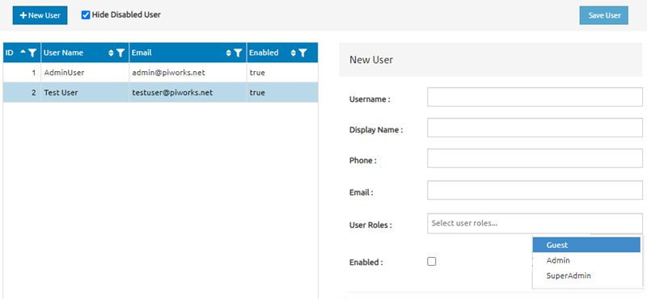

# Please prepare the user interface specification document in English for the user management screen below (Markdown syntax preferred). It should include the requirements, details related to UI components, the behavior of the page when using these components, what to show to the user at the beginning, etc. This document will be used by Software developers who will develop this user interface.

# User Interface Specification Document: User Management Screen

## Overview

This document outlines the user interface (UI) specifications for the User Management Screen. The screen allows administrators to manage users within the system, including creating, editing, and enabling/disabling user accounts.

## Initial State

Upon loading the User Management Screen, the interface displays a list of active users in a table format, along with a form on the right-hand side for creating a new user or editing an existing user. The page is designed to be intuitive, providing clear options for managing user accounts.

### Default UI Components

1.  **User List Table**
    
    -   **Columns:**
        
        -   `ID`: Unique identifier for the user (integer, auto-incremented).
        -   `User Name`: The username of the user (string).
        -   `Email`: The email address associated with the user (string).
        -   `Enabled`: A boolean indicator showing whether the user account is active (`true`) or inactive (`false`).
    -   **Functionalities:**
        
        -   Sorting: Users can sort by any column by clicking the column header.
        -   Filtering: By clicking the filter icon in the column header, users can filter results based on that column’s values.
2.  **New User / Edit User Form**
    
    -   **Fields:**
        
        -   `Username`: Text input for the user's username (required).
        -   `Display Name`: Text input for the user's display name (optional).
        -   `Phone`: Text input for the user's phone number (optional).
        -   `Email`: Text input for the user's email address (required).
        -   `User Roles`: Dropdown menu allowing the selection of one or more roles (e.g., Guest, Admin, SuperAdmin).
        -   `Enabled`: Checkbox indicating whether the user is active. If checked, the user is enabled.
    -   **Buttons:**
        
        -   `Save User`: Saves the current user details to the database. This button is disabled if required fields are not filled.
3.  **Toolbar**
    
    -   `+ New User`: Button that clears the form and prepares it for creating a new user.
    -   `Hide Disabled Users`: Checkbox that, when checked, filters the user list to display only enabled users.

## User Scenarios

### Scenario 1: Adding a New User

1.  The admin clicks the `+ New User` button.
2.  The form on the right clears, allowing the admin to enter the new user's details.
3.  The admin fills out the `Username`, `Email`, selects appropriate `User Roles`, and optionally fills out other fields.
4.  The admin checks the `Enabled` box if the user should be active upon creation.
5.  The admin clicks the `Save User` button to create the user.
6.  The user is added to the list, and the form is cleared for the next operation.

### Scenario 2: Editing an Existing User

1.  The admin selects a user from the user list.
2.  The form on the right populates with the selected user's details.
3.  The admin edits any necessary fields.
4.  The admin clicks the `Save User` button to update the user's information.
5.  The user list updates to reflect the changes.

### Scenario 3: Disabling a User

1.  The admin selects a user from the user list.
2.  The form on the right populates with the selected user's details.
3.  The admin unchecks the `Enabled` box.
4.  The admin clicks the `Save User` button to update the user.
5.  The user list updates, and the user is marked as disabled.
6.  If the `Hide Disabled Users` checkbox is checked, the user disappears from the list.

### Scenario 4: Filtering Users

1.  The admin checks the `Hide Disabled Users` checkbox.
2.  The user list updates to show only enabled users.
3.  The admin can also use column filters to further narrow down the user list.